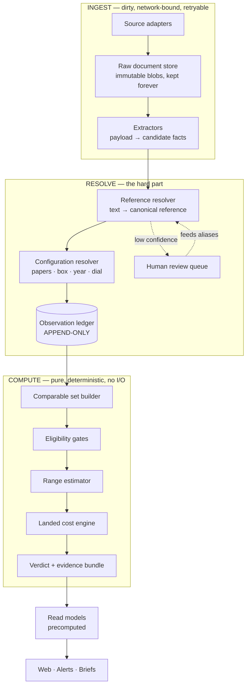
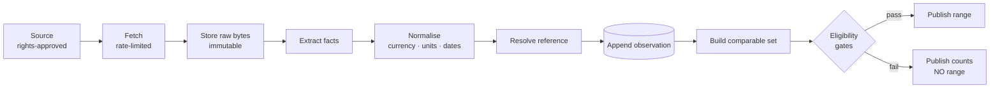
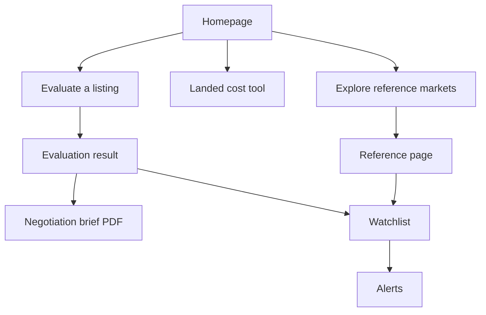

# WatchLedger — Master Blueprint

> **Paste the link. We'll tell you if the price is fair — and show you why.**

This document is the single source of truth for what WatchLedger is, why it exists, how it is built, how it is funded, and how it is run. It is written from the founder/CEO seat and covers the whole lifecycle: thesis → data → architecture → product → go-to-market → money → operations → risk → endgame.

---

## Table of contents

1. [Thesis](#1-thesis)
2. [The market and why this gap exists](#2-the-market-and-why-this-gap-exists)
3. [Positioning and product promise](#3-positioning-and-product-promise)
4. [Sources of truth](#4-sources-of-truth)
5. [Architecture](#5-architecture)
6. [The data lifecycle](#6-the-data-lifecycle)
7. [The verdict engine](#7-the-verdict-engine)
8. [Landed cost engine](#8-landed-cost-engine)
9. [Product surfaces](#9-product-surfaces)
10. [Build sequence](#10-build-sequence)
11. [Go-to-market with zero budget](#11-go-to-market-with-zero-budget)
12. [Business model](#12-business-model)
13. [Trust, ethics and compliance](#13-trust-ethics-and-compliance)
14. [Operations](#14-operations)
15. [Metrics](#15-metrics)
16. [Risk register](#16-risk-register)
17. [Team and hiring](#17-team-and-hiring)
18. [Endgame](#18-endgame)
19. [Decision log](#19-decision-log)

---

## 1. Thesis

The pre-owned watch market runs on **asking prices**, which are seller aspirations, aggregated and presented as market data. The largest aggregators earn commission on transactions, so they have no incentive to tell a buyer *"this is overpriced"* or *"we don't know enough to say."*

WatchLedger exists to publish the two truths that market structure suppresses:

1. **What people actually paid** — realised prices, not asks.
2. **What it will actually cost you** — landed cost after FX, shipping, duty and VAT.

### The core principle

> WatchLedger is a **reproducible verdict engine**, not a price database.

Every verdict must be re-derivable, byte-for-byte, from stored evidence plus a versioned ruleset, months later. If a verdict cannot be reproduced, it cannot be defended. A price product that cannot defend itself is worthless.

### The three non-negotiables

| Principle | Meaning |
|---|---|
| **Evidence before verdict** | Show the comparable set and its quality before the conclusion. |
| **Honest uncertainty** | "We don't know yet" is a valid, valuable output — never a failure state. |
| **No transaction interest** | We never earn more when you buy. That is the entire product. |

---

## 2. The market and why this gap exists

### Someone did build this

WatchCharts built the independent price index. **Chrono24 acquired them in 2023.** That single fact defines the market:

- The independent price-truth layer is valuable.
- It is existentially threatening to the marketplace.
- The marketplace has more capital, so it buys the index.
- Post-acquisition, "independent" pricing sits inside the company earning commission on the sale.

**The gap keeps closing through acquisition, not product failure.** That is the opportunity and the trap.

### The four barriers that kill attempts

| # | Barrier | Why it kills people | Our answer |
|---|---|---|---|
| 1 | **Data access** | Compliant path yields no data; scraping yields lawsuits and unbuyability | Invert the source order — start with public auction records |
| 2 | **Comparability** | Two identical refs differ 30% legitimately; solving it is slow, manual, undemoable | Transparent deterministic tiers, not a black-box model |
| 3 | **Asks ≠ transactions** | Listing data measures wishes; real signal needs months of history | Auction results give decades of history on day one |
| 4 | **Landed cost** | Jurisdictional swamp, tedious, liability risk | Do it precisely — the tedium *is* the moat |

### Market constraints we design around

| Constraint | Design consequence |
|---|---|
| Buyers transact 1–3× per year | Retention must be **outbound** (alerts), not a dashboard |
| Trust is the entire product | One wrong verdict is fatal — conservatism is engineered in |
| Enthusiast community is small and allergic to marketing | Distribution must be a product feature, not a campaign |
| Affiliate revenue reproduces the conflict we criticise | No affiliate revenue at launch |

---

## 3. Positioning and product promise

### The pivot

| From | To |
|---|---|
| "Know what a watch is worth" | "See what is actually known — and where it stops" |
| A **coverage** promise (unwinnable) | An **honesty** promise (uncontestable) |
| Asking prices | Realised prices + landed cost |

A coverage promise loses permanently: the marketplace owns the inventory, and every gap in our data is a visible failure. An honesty promise turns thin data into the product's output rather than its embarrassment.

### The line that is the whole company

```
Asking prices        €14,200 – €16,800   (23 listings)
Auction realised     €12,900 – €14,100   (11 results)

Asks typically sit ~12% above realised for this reference.
```

This is only possible because both sides live in one ledger — and no marketplace can publish it about its own listings.

### What we are not

- Not an investment or ROI predictor
- Not an authenticator or condition grader
- Not a marketplace
- Not a "true value" oracle — the **range** is the honest answer

---

## 4. Sources of truth

Ranked by defensibility. **The strategic error is starting at the bottom.**

| Tier | Source | Access | Signal | Phase |
|---|---|---|---|---|
| **1** | **Auction results** — Phillips, Christie's, Sotheby's, Bonhams, Antiquorum | Public, permanent record | **Realised prices** — strongest possible | 2 |
| **2** | **Official APIs** — eBay Browse | Official ToS, free | Asks + sold + delisting behaviour, huge volume | 3 |
| **3** | **User-reported paid prices** | Earned through trust | **Proprietary** — cannot be bought or scraped | 5 |
| **4** | **Dealer direct feeds** | Negotiated, needs leverage | Richest attributes | 6 |
| **5** | ~~Scraping gated inventory~~ | **Never** | — | — |

### Why Tier 1 first

- **No cold start.** Auction houses publish historical results — we launch with years of data instead of waiting six months to become useful.
- **No permission problem.** Published results are not gated inventory.
- **Undisputable.** A hammer price is a fact. No marketplace can spin it.
- **Bootstraps the catalogue.** The reference data needed for comparability is derived free from the auction corpus.

### Why we never scrape

Not primarily legal. A scraper is **unbuyable, unfundable, and unpartnerable.** The moment we scrape, every future conversation with a dealer, an auction house, an investor, or an acquirer is dead. Clean rights are an asset on the balance sheet, not a constraint on the roadmap.

**This is enforced in the database, not in code review** — see [§13](#13-trust-ethics-and-compliance).

---

## 5. Architecture

### Layering rule

> Dependencies point downward only. The compute layer never touches the network. The ingest layer never produces a verdict.

This is what makes verdicts auditable and the system testable offline.



### The four stores

| Store | Mutability | Purpose |
|---|---|---|
| **Catalogue** | Curated, versioned | Brands, families, references, variants, aliases |
| **Raw documents** | **Immutable** | Original bytes, kept forever. Re-run extractors against history when they have bugs |
| **Observations** | **Append-only** | Price events with timestamps. Never updated in place |
| **Verdicts** | Content-addressed | `inputs_hash + ruleset_hash → result`. Same evidence + same rules = same verdict, always |

### Why append-only

Price history, change detection, and delisting analysis all fall out **for free**. A listing at a new price is a new row. Unchanged, it is a no-op. We never write history logic because history is the storage model.

---

## 6. The data lifecycle



### Stage rules

**Fetch** — only rights-approved sources, host-pinned, rate-limited, size-capped. Fails closed on any ambiguity.

**Store raw** — original bytes retained permanently. Storage is cheap; re-collection may be impossible.

**Extract** — pure function over stored bytes. Testable offline against fixtures. Never touches the network.

**Normalise** — currency to `Decimal`, dates to UTC, units canonicalised, auction premium separated from hammer price.

**Resolve** — see [§7](#7-the-verdict-engine).

**Append** — never mutate. Deduplication by content hash gives change detection at no cost.

### Derived signals nobody else surfaces

Because observations are append-only and timestamped:

- **Median days-to-delist** — the real liquidity measure
- **Price-cut frequency** — asks that dropped before vanishing were mispriced
- **Ask-to-realised spread** — the gap between aspiration and reality

---

## 7. The verdict engine

### 7.1 Reference resolution — cascade, never guess

| Rung | Method | Confidence | Action |
|---|---|---|---|
| 1 | Structured field from source | 1.00 | Accept |
| 2 | Exact normalised code match | 0.98 | Accept |
| 3 | Known alias hit | 0.90 | Accept |
| 4 | Fuzzy similarity + brand match | 0.70 | **Review queue** |
| 5 | No match | — | Unresolved |

**Never auto-accept below 0.85.** Every human resolution feeds the alias table, so precision compounds while the system stays fully explainable.

### 7.2 Comparability tiers

| Tier | Definition | Used for range? |
|---|---|---|
| `EXACT` | Same reference, same price-relevant variants | **Yes — only this** |
| `VARIANT` | Same reference, different dial/bracelet | Context only, labelled |
| `RELATED` | Sibling reference in family | Context only, labelled |
| `EXCLUDED` | Damaged, aftermarket, franken, parts | **Shown with reason** |

**Visible exclusions are a trust signal, not clutter.** They prove we are actually looking.

### 7.3 Adjustments — declared, never learned

Every attribute adjustment cites the evidence that produced it, and that citation is shown in the UI:

```
No papers      −6%    based on 148 paired auction results, 2023–2026
Full set       +4%    based on 92 paired auction results, 2023–2026
```

When a user asks "why?", the answer is already on the page.

### 7.4 Eligibility gate — conservative by default

A range is published **only if all four hold**:

| Gate | Threshold |
|---|---|
| Volume | ≥ 8 exact-tier observations |
| Diversity | ≥ 3 independent sources |
| Freshness | Most recent < 180 days |
| Dispersion | IQR ratio < 2.5× |

Otherwise, **no number appears** — a number on screen is a claim, regardless of the badge beside it:

```
LIMITED MARKET COVERAGE
5 exact-configuration observations · 2 sources
No published range — needs 8 observations from 3 sources
```

**Refusing to publish is the feature.** It is precisely what a marketplace-owned index cannot credibly do.

### 7.5 Statistics

- **Trimmed range** (10th–90th percentile) + **median**
- **Never the mean** — one fantasy ask destroys it
- **Never a single "value"** — that claims precision we do not have

---

## 8. Landed cost engine

The zero-data product. Useful on day one, needs no partnerships, and answers a question people actively search for.

### Output is a breakdown, never a number

```
Item price              ¥3,200,000  →  €19,847
FX  (ECB 2026-09-01, +1.5% card spread)      €298
Shipping + insurance                          €180
─────────────────────────────────────────────────
Customs value (CIF)                        €20,325
Duty  4.5%  ·  HS 9102.21                     €915
Import VAT  23% on (CIF + duty)             €4,885
─────────────────────────────────────────────────
Estimated landed cost                      €26,125
                                    +31.6% over ask

⚠ Assumes commercial import at full VAT.
  Private-sale margin schemes may not apply.
  Estimate only — not customs advice.
```

### Engine rules — non-negotiable

1. **Decimal arithmetic throughout.** Never float for money. Quantize once, at display.
2. **No line item without a stated basis.** If we cannot explain it, we do not charge it.
3. **Assumptions are surfaced and user-editable**, never silently applied.
4. **Every rule carries `source_url` + `verified_at`.** Unverified for >180 days auto-renders a staleness warning.
5. **Reproducible.** Output embeds `rules_version` + `fx_date`, so any permalink re-derives exactly.

### Liability posture

Estimate framing throughout, legal source cited per rule, automatic staleness, prominent disclaimer. Tedious — which is exactly why it is defensible. Nobody else wants to do it.

---

## 9. Product surfaces



| Surface | Job | Phase |
|---|---|---|
| **Landed cost tool** | Free front door. One page per corridor, no login | 1 |
| **Reference page** | Auction-backed evidence. Permanent SEO body | 2 |
| **Listing evaluator** | The core job: paste URL → verdict + landed cost | 4 |
| **Negotiation brief** | One-page evidence PDF. **The share vector** | 4 |
| **Watchlist + alerts** | The retention loop | 5 |
| **Methodology page** | Public rules. Credibility infrastructure | 2 |
| **Dealer portal** | Positioning + completeness audit. Revenue | 6 |

### The manual entry path is a first-class citizen

Most listings will not parse early on. The structured manual form is **the primary path at launch**, not a degraded fallback. Design it that way.

---

## 10. Build sequence

**Strictly by decreasing data dependency — so we ship value before solving the hard problem.**

| Phase | Ships | Requires | Unlocks |
|---|---|---|---|
| **0** | Schema, ruleset framework, verdict reproducibility harness | — | Everything |
| **1** | Landed-cost engine + corridor pages | **Nothing** | SEO traffic |
| **2** | Auction ingestion, 5 families, reference pages, methodology | Public records | Credibility |
| **3** | eBay API → ask-vs-realised spread, liquidity signals | Free API key | The signature insight |
| **4** | Listing evaluator + negotiation brief | Phases 2–3 | Word of mouth |
| **5** | Watchlist, alerts, user-reported paid prices | Trust | Proprietary data |
| **6** | Dealer feeds + portal | Traffic as leverage | Revenue |

### Scope discipline

**Phase 2 covers five families only:** Rolex Submariner, Rolex Datejust, Omega Speedmaster Professional, Tudor Black Bay, Seiko SKX/Alpinist.

Excellent coverage of 20 references beats thin coverage of 500. **Thin coverage actively destroys the trust the entire thesis rests on.**

### Why this order matters

```
Phase 1 (needs nothing) ──SEO traffic──┐
                                        ├──> Phase 6 dealer feeds
Phase 2 (public records) ──credibility──┘
```

Nothing is blocked on permission until we have the leverage to ask for it. **Attacking dealer feeds first is why this product usually dies.**

---

## 11. Go-to-market with zero budget

Distribution cannot be a marketing activity. It must be **engineered into the product**.

### The four mechanisms

**1. Free tool as front door.** The landed-cost calculator needs no data, no login, no partnerships. One canonical page per corridor:

```
/tools/landed-cost/japan-to-portugal
/tools/landed-cost/usa-to-uk
/tools/landed-cost/switzerland-to-germany
```

Real queries, real intent, near-zero competition.

**2. Negotiation brief as share vector.** Buyers post these in forums to argue their case. Every post is a link, a referral, and a credibility proof. **We are not marketing — users are, because the artefact is useful to them.**

**3. Auction-backed reference pages as SEO body.** Permanent, factual, indexable, deep not broad.

**4. Communities as launch.** r/Watches, r/WatchExchange, WatchUSeek, Omega Forums, TZ-UK.

> Participate genuinely for 3–4 weeks first. Then: *"I built this because I got burned on import duty."*
> That works. An announcement does not.

### Compounding sequence

```
Free tool → traffic → credibility → dealer feeds → richer data → more traffic
```

---

## 12. Business model

### Revenue, in order of introduction

| Phase | Stream | Notes |
|---|---|---|
| 6 | **Dealer subscriptions** | Positioning, completeness audits, competitive monitoring |
| 6 | **Pro buyer tier** | Unlimited alerts, full history, export, brief generation |
| 7 | **Licensed data** | Insurers, valuers, estate professionals — they pay for *accuracy* |
| — | ~~Affiliate commission~~ | **Rejected at launch** |

### Why no affiliate revenue

The entire pitch is *"we have no incentive to sell you this watch."* Taking a cut of the sale contradicts it on day one, and the contradiction is unrecoverable. Every customer above pays for **accuracy**, not for a transaction. That alignment is the product.

### Cost posture

Near-zero infrastructure. Single application, single database, managed auth and email. The scarce resources are **attention and trust**, not compute.

---

## 13. Trust, ethics and compliance

### Compliance is enforced structurally

A source cannot be enabled unless it is rights-approved with recorded evidence and a named reviewer. This is a **database constraint**, not a code-review convention:

```
enabled = true  REQUIRES
    access_status = 'approved'
    AND rights_basis IS NOT NULL
    AND rights_reviewed_at IS NOT NULL
```

**It is structurally impossible to accidentally scrape.** That property is an asset in every dealer, investor, and acquisition conversation.

### Editorial rules

| Rule | Rationale |
|---|---|
| No range without passing all four gates | A number is a claim |
| No "true value" language | False precision |
| No investment or ROI claims | Regulatory exposure, zero upside |
| No authenticity or condition grading | We cannot verify it |
| Public methodology page, always current | Auditable by anyone |
| Dealers can never pay to improve a public verdict | Stated publicly, permanently |

### The golden-verdict test suite

Frozen observation sets map to frozen verdicts. **Any unintended change fails CI.** A silent shift in pricing logic is the failure mode that ends the company's credibility — so it is made structurally impossible to ship one unnoticed.

---

## 14. Operations

### Daily
Ingestion runs by source cadence. Failures alert but never block publication — stale-but-honest beats fresh-but-wrong.

### Weekly
Human review queue for unresolved references. Every resolution improves the alias table permanently.

### Monthly
Tax-rule verification sweep. Rules stale >180 days auto-warn in the UI until re-verified.

### Per release
Golden verdict suite must pass. Ruleset changes are versioned, hashed, diffed, and deliberate.

### Incident posture

| Failure | Response |
|---|---|
| Source breaks | Degrade to fewer sources; gates may fail; publish counts instead of a range |
| Bad verdict shipped | Roll back ruleset version; verdicts recompute deterministically |
| Rights revoked | Disable source; historical raw documents retained; recompute without it |

Every failure mode degrades toward **saying less**, never toward saying something wrong.

---

## 15. Metrics

### The one metric that matters

> **Evaluations that a user acts on** — brief downloaded, watchlist added, or outcome reported.

Not pageviews. Not signups. **Decisions influenced.**

### Supporting

| Layer | Metric |
|---|---|
| Data | References passing eligibility gates; source diversity; freshness |
| Quality | Resolution accuracy; review-queue depth; golden-suite stability |
| Product | Evaluation → brief conversion; alert open rate |
| Distribution | Organic corridor-page traffic; forum-referred sessions |
| Trust | User-reported paid prices submitted **(the leading indicator of everything)** |

### Vanity metrics we explicitly ignore

Total references tracked. Total listings ingested. These reward breadth, which is exactly the failure mode.

---

## 16. Risk register

| # | Risk | Severity | Mitigation |
|---|---|---|---|
| 1 | **Acquisition trap** — starved or bought cheap | High | Own transaction data they lack; serve the buyer against seller interest; jurisdiction depth |
| 2 | **Data access never opens** | High | Phases 1–3 need no permission and are a complete product on their own |
| 3 | **One wrong verdict destroys trust** | Critical | Conservative gates, golden tests, versioned rules, visible evidence |
| 4 | **Auction data too sparse per reference** | Medium | Five families only; publish counts when gates fail |
| 5 | **Tax rules go stale** | Medium | `verified_at` per rule, automatic staleness warnings |
| 6 | **No retention** | Medium | Alerts and briefs are outbound by design |
| 7 | **Solo founder bandwidth** | High | Buy auth, email, hosting. Build only the ledger, engine and rules |

### The acquisition answer in detail

We cannot out-capitalise Chrono24. So we become **the wrong shape to absorb**:

1. **Own transaction data, not listing data.** They already have listings. Buying us for listings is pointless. Realised prices plus user-reported paid prices is a dataset they do not have.
2. **Serve the buyer explicitly, against the seller's interest.** The more useful we are at saying *"don't buy this,"* the more our value evaporates on acquisition. That is the poison pill.
3. **Be jurisdiction-deep.** Landed cost for EU import is unglamorous and hard, which is why it survives.

Acquisition remains a fine outcome — just at our price, not because we were starved.

---

## 17. Team and hiring

**Phases 0–3: one person.** The work is schema design, rules encoding, and content. Adding people here slows it down.

**First hire (Phase 4–5): a data curator, not an engineer.** Comparability quality is the product, and it is human work: aliases, variants, exclusions, adjustment evidence.

**Second hire (Phase 6): business development.** Dealer relationships are a relationship business, not a product problem.

Engineering headcount is the **last** thing needed. The architecture is deliberately small enough that it does not require a team.

---

## 18. Endgame

Three viable outcomes, in preference order:

**1. The independent reference layer.** Insurers, valuers, auction houses and estate professionals cite WatchLedger because it is the only source that publishes its method and admits its limits. Revenue from licensing and professional tools. Independent indefinitely.

**2. Acquisition at leverage.** A marketplace or auction group buys the transaction dataset and the rights position. Acceptable — provided it happens because we are valuable, not because we are starving.

**3. Category expansion.** The architecture — append-only observation ledger, deterministic verdict engine, jurisdictional landed cost — is **category-agnostic**. It transfers directly to any opaque, high-value, cross-border secondary market: classic cars, cameras, guitars, art. Watches are the beachhead, not the ceiling.

---

## 19. Decision log

Decisions taken, with reasoning, so future-us does not relitigate them:

| # | Decision | Reasoning |
|---|---|---|
| 1 | Realised prices before asks | Better signal, publicly available, no cold start |
| 2 | Honesty promise, not coverage promise | Coverage is unwinnable against the inventory owner |
| 3 | Never scrape gated inventory | Unbuyable, unfundable, unpartnerable |
| 4 | Compliance enforced in schema | Discipline fails; constraints do not |
| 5 | Five families only at launch | Thin coverage destroys trust |
| 6 | No affiliate revenue at launch | Contradicts the entire pitch |
| 7 | No LLM in the verdict path | Non-deterministic and unauditable — violates the core thesis |
| 8 | Append-only observations | History, change detection and liquidity signals come free |
| 9 | Landed cost first | Only surface needing zero data; earns the traffic that unlocks everything else |
| 10 | Manual entry as first-class | It is the majority path at launch |

---

## The blueprint in one line

> **Build an append-only evidence ledger with a pure, versioned, reproducible verdict engine on top — start with auction realised prices and a zero-data landed-cost tool, and use the resulting traffic as leverage to unlock the transaction data no competitor can scrape.**

The constraints that look fatal — no data, no money, no audience — point directly at the only defensible position available.
