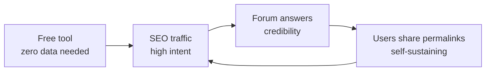

# WatchLedger — Go-to-Market Playbook

> **Be the best answer to the question they're already typing, at the exact moment they're typing it.**

Companion to [WATCHLEDGER_MASTER_README.md](WATCHLEDGER_MASTER_README.md) (strategy) and [WATCHLEDGER_UX_SPEC.md](WATCHLEDGER_UX_SPEC.md) (the product surface).

This document contains the **actual copy** — ready to publish, post, or send. Not guidance about what to write. The words themselves.

---

## Table of contents

1. [The acquisition thesis](#1-the-acquisition-thesis)
2. [Channel plan](#2-channel-plan)
3. [Site copy](#3-site-copy)
4. [Corridor page — full copy](#4-corridor-page--full-copy)
5. [Article — Is it actually cheaper to buy from Japan?](#5-article--is-it-actually-cheaper-to-buy-from-japan)
6. [Article — What if the seller undervalues the package?](#6-article--what-if-the-seller-undervalues-the-package)
7. [Article — Does Chrono24's price include import tax?](#7-article--does-chrono24s-price-include-import-tax)
8. [Reddit and forum replies](#8-reddit-and-forum-replies)
9. [Launch posts](#9-launch-posts)
10. [Emails](#10-emails)
11. [Outreach](#11-outreach)
12. [Content calendar](#12-content-calendar)
13. [Measurement](#13-measurement)
14. [Rules and failure modes](#14-rules-and-failure-modes)

---

## 1. The acquisition thesis

### The ICP is a moment, not a demographic

> They found the listing. They're suspicious of the price. They haven't paid yet.

That window is about 20 minutes long and has three properties that decide the entire strategy:

| Property | Consequence |
|---|---|
| **It generates a search** | They type the question. We can be the answer |
| **It generates a forum post** | They ask humans. That post is public and permanent |
| **It has a deadline** | They decide within days. No nurture sequence needed |

**We do not need a following. We need to be findable at the moment of anxiety.**

### The compounding sequence



The goal is to **make ourselves unnecessary**. Once users post our links in threads we've never seen, acquisition compounds without us.

### The one rule

> Never trade intent for volume.

Ten people who searched *"japan watch customs portugal"* are worth more than fifty thousand who scrolled past a viral post.

---

## 2. Channel plan

| Tier | Channel | Effort | Payoff | Timeline |
|---|---|---|---|---|
| **1** | SEO — corridor pages + fear queries | High upfront | Compounds forever | Months 4+ |
| **2** | Reddit + forums | 3–5 answers/week, ongoing | First 100 users | Immediate |
| **3** | Launch posts | One week | Spike + feedback | Day one |
| **4** | Micro-influencer seeding | Low | Occasional credit | Weeks |
| **5** | The share loop (in-product) | Built once | Self-sustaining | Month 2+ |

### Where the moment is visible

**Google.** Low volume, near-zero competition, highest intent on earth.

**Reddit.** `r/Watches`, `r/WatchExchange`, `r/rolex`, `r/Seiko`, `r/omega`, plus country subs (`r/portugal`, `r/ireland`, `r/AskUK`) where import questions appear weekly.

**Forums.** WatchUSeek, Omega Forums, TZ-UK, Rolex Forums, WatchCrunch. Slower, but threads rank in Google for years.

**YouTube comments.** Under every "I bought a watch from Japan" video sit dozens of unanswered *"how much was customs?"* comments.

### Target queries

```
how much is customs on a watch from japan
buying watch from japan to portugal tax
seiko from japan import duty uk
is it cheaper to buy a watch from japan
does chrono24 include import tax
watch import duty calculator
jomashop customs charges uk
what happens if seller undervalues package customs
```

**Most of these are not about the product category. They are about a fear.** Write for the fear.

---

## 3. Site copy

### Homepage — hero

```
That watch from abroad.
What will it actually cost you?

Import duty, VAT and currency spread — calculated from
official rates we verify and cite.
```

**Sub-line under the inputs:**

```
No signup. No tracking. Every rate links to its source.
```

### Meta description (homepage)

```
Work out the real cost of importing a watch — duty, VAT, FX
and shipping. Official rates, cited and dated. Free, no signup.
```

### Nav

```
WatchLedger                    Methodology
```

That's it. No "Pricing", no "About", no "Blog" until there are five articles.

### Footer

```
Estimate only — not customs advice. Actual charges depend on
your customs authority's valuation of the goods.

Rules v2026.09.1 · FX 8 Sept 2026 · Methodology · Sources
```

### Methodology page — opening

```
How we calculate

Every number on this site comes from a rule we have read on an
official government source, recorded with a link and a date.

We do not estimate rates. We do not average them. If we have not
verified a rate for a country, we do not publish a number for it.

Rules older than 180 days are flagged in the interface until we
re-check them.

Below is every rule currently in use.
```

Then the table, generated from the rules database.

---

## 4. Corridor page — full copy

**URL:** `/tools/landed-cost/japan-to-portugal`
**Title tag:** `Importing a watch from Japan to Portugal — the real cost (2026)`
**Meta:** `Duty 4.5%, VAT 23% on CIF plus duty. Worked example, official sources, free calculator. Updated September 2026.`

---

```
# Importing a watch from Japan to Portugal

## What you'll actually pay

[ CALCULATOR — prefilled JPY → Portugal ]

---

## The short answer

Portugal charges two things on a watch arriving from Japan:

  Import duty    4.5%   on the customs value
  Import VAT     23%    on the customs value plus the duty

The second one is where people get caught. VAT is not charged on
the item price. It is charged on the item price, plus shipping,
plus insurance, plus the duty you just paid.

On a €20,000 watch that difference is about €200 — small. On the
overall bill it is about 31% on top of the listing price, which
is not small at all.

---

## Worked example

A Japanese dealer lists a watch at ¥3,200,000. Shipping and
insurance are ¥29,000. You are in Portugal.

  Item price               ¥3,200,000    →   €19,847
  Card / bank FX spread     1.5%             €298
  Shipping + insurance                       €180
  ─────────────────────────────────────────────────
  Customs value (CIF)                     €20,325

  Import duty     4.5%                       €915
  Import VAT      23% on CIF + duty        €4,885
  ─────────────────────────────────────────────────
  Total                                   €26,125

The listing said €19,847. You pay €26,125.

That is €6,278 more, or 31.6%.

---

## What each charge is, and where it comes from

**Import duty — 4.5%**
Wristwatches fall under HS heading 9102. The EU Common Customs
Tariff sets the rate. It applies to the customs value, which is
the item price plus shipping and insurance to the EU border.
→ EU TARIC database · verified 14 Aug 2026

**Import VAT — 23%**
Portugal's standard VAT rate. Charged on the customs value plus
the duty. This is the single largest charge and the one most
often underestimated.
→ Autoridade Tributária e Aduaneira · verified 14 Aug 2026

**The FX spread — usually 1–3%**
The ECB publishes a daily reference rate. Your bank or card
will not give you that rate. Most add 1–3%. We default to 1.5%
and you can change it.
→ European Central Bank daily reference rates

**Courier handling fee — €10–25**
DHL, FedEx and UPS charge a fee for presenting the goods to
customs and advancing the duty on your behalf. It is separate
from the duty and VAT, and it is not included above.

---

## When duty doesn't apply

**Under €150.** No import duty. VAT is still charged from the
first cent — the €22 VAT exemption was removed across the EU in
July 2021.

**Gifts under €45.** Between private individuals, genuinely a
gift, with no payment. Watches almost never qualify and customs
know it.

**Returning your own watch.** If you owned it in the EU, took it
out, and are bringing it back, Returned Goods Relief may apply.
You need proof of prior ownership. Get advice before relying on
this.

**Temporary import for repair.** Different regime, different
paperwork. Not covered by this calculator.

---

## Four things people get wrong

**VAT is charged on the duty, not just the item.**
It compounds. On a €20,000 watch the duty adds about €915 to the
VAT base, which costs you about €210 in extra VAT.

**Shipping is part of the customs value.**
Paying €180 for shipping does not cost you €180. It costs €180
plus 4.5% duty plus 23% VAT on the whole lot.

**"DDP" does not always mean everything is covered.**
Delivered Duty Paid should mean the seller handles duty and VAT.
Some listings say DDP and mean "we'll ship it and you sort out
customs." Ask, in writing, before paying.

**The declared value is your problem, not the seller's.**
If a seller declares €500 on a €20,000 watch and customs
disagree, you deal with the consequences. Details below.

---

## Sources

  EU Common Customs Tariff (TARIC), heading 9102
  → [link] · verified 14 Aug 2026

  Autoridade Tributária — IVA na importação
  → [link] · verified 14 Aug 2026

  European Central Bank — euro reference rates
  → [link] · daily

Last reviewed 14 August 2026. We re-check every rule at least
every 180 days and flag anything older in the calculator.

---

Estimate only — not customs advice.
```

### Structured data

`FAQPage` on the "Four things people get wrong" and "When duty doesn't apply" sections. `BreadcrumbList` for the corridor hierarchy.

---

## 5. Article — Is it actually cheaper to buy from Japan?

**URL:** `/guides/is-it-cheaper-to-buy-a-watch-from-japan`
**Title tag:** `Is it actually cheaper to buy a watch from Japan? (2026 maths)`
**Meta:** `We ran the numbers on three real watches. Sometimes yes, sometimes no. Here's how to tell which one you're looking at.`

**This is the highest-intent, most shareable piece. Write it first.**

---

```
# Is it actually cheaper to buy a watch from Japan?

Sometimes. Less often than the listings suggest.

Here is the maths, on three real examples, including the one
where importing is a clearly bad idea.

---

## Why Japanese listings look so cheap

Three real reasons and one illusion.

**Real: no consumption tax for you.** Japanese dealers sell
export-free to overseas buyers, stripping 10% consumption tax off
the domestic price.

**Real: a deep domestic market.** Japan has an enormous, mature
pre-owned watch market with high supply and genuinely competitive
dealer margins.

**Real: the yen.** Over the last few years the yen has been weak
against the euro, which flatters every Japanese price to a
European eye.

**The illusion: the listing price is not the price.** It excludes
import duty, VAT, FX spread and the courier's handling fee. In
the EU that is usually 28–32% on top.

---

## Three real examples

### Example 1 — importing wins

A 1970s vintage diver. Rare in Europe, common in Japan.

  Japanese listing              €4,200
  Landed in Portugal            €5,530
  Typical European asking       €6,800

  Importing saves you           €1,270

Why it wins: thin European supply. The local price carries a
scarcity premium larger than the tax.

### Example 2 — roughly a draw

A current-production Seiko.

  Japanese listing              €1,050
  Landed in Portugal            €1,380
  Typical European asking       €1,340

  Importing costs you           €40 more

Why it's a draw: the model is widely available in Europe. You
pay the same and wait three weeks. Buy locally.

### Example 3 — importing loses badly

A modern Swiss sports watch, high demand everywhere.

  Japanese listing             €19,850
  Landed in Portugal           €26,125
  Typical European asking      €24,900

  Importing costs you           €1,225 more

Why it loses: the model is liquid globally. Prices converge.
The tax is pure additional cost, and you also lose easy warranty
access and the ability to inspect before paying.

---

## The rule of thumb

Importing from Japan is worth it when **the European scarcity
premium is larger than about 30%.**

That happens with:

  · Vintage and discontinued references
  · JDM-only models never sold in Europe
  · Unusual dials and configurations
  · Anything where you can find fewer than five European examples

It does not happen with:

  · Current production
  · High-demand modern sports watches
  · Anything a European dealer has three of

---

## The costs people forget

**Warranty.** A Japanese dealer's warranty is a Japanese
dealer's warranty. Shipping a watch back for a claim costs
several hundred euros and several weeks.

**Inspection.** You are buying photographs. Reputable Japanese
dealers are genuinely excellent at description, but you cannot
put it on your wrist first.

**Returns.** Return shipping plus the fact that reclaiming paid
import VAT is possible but tedious. Assume you are keeping it.

**Time.** Two to four weeks, plus a customs hold if the courier
wants documentation.

---

## Work out your own number

The calculator below uses the official duty and VAT rates for
your country, with each rate linked to its source and dated.

[ CALCULATOR ]

---

## The honest summary

If you are buying something rare, importing from Japan is often
the right call and the tax is worth paying.

If you are buying something you could get from a dealer an hour
away, you are usually paying more for the privilege of waiting
longer and having less recourse.

Run the number before you decide, not after the courier invoices
you.
```

---

## 6. Article — What if the seller undervalues the package?

**URL:** `/guides/undervalued-customs-declaration`
**Title tag:** `What happens if a seller undervalues a watch for customs?`
**Meta:** `Sellers sometimes offer to declare a lower value. Here's what actually happens, and who carries the risk. (It's you.)`

**Nobody answers this honestly. That is exactly why it's worth writing.**

---

```
# What happens if the seller undervalues the package?

Some overseas sellers will offer to declare a watch at a
fraction of its price, or mark it as a gift. It sounds like it
saves you a few thousand euros.

Here is what actually happens.

---

## Who carries the risk

**You do.** Not the seller.

The importer of record is the person receiving the goods. That
is you. If the declaration is wrong, you are the one customs
contacts, the one who pays the corrected amount, and the one
who deals with any penalty.

The seller is in another jurisdiction and has already been paid.

---

## What customs actually do

Customs officers see thousands of parcels. A watch declared at
€200 in a €40 insured courier box from a known watch dealer is
not subtle.

Common outcomes, roughly in order of frequency:

**Revaluation.** Customs reject the declared value and substitute
their own, usually based on comparable market prices. You pay
duty and VAT on their number. Their number is often higher than
the price you actually paid, and you have to prove otherwise.

**Documentation request.** The parcel is held until you provide
the invoice, payment proof and correspondence. Delays of two to
six weeks are normal. You may end up handing over the very
evidence that shows the declaration was false.

**Penalty.** Some authorities add a fine on top of the corrected
duty and VAT.

**Seizure.** Uncommon for a first offence, but it happens,
particularly with repeat importers or large discrepancies.

---

## The insurance problem nobody mentions

If a €20,000 watch is declared at €500 and the courier loses it,
you are insured for €500.

You cannot claim on a value you asked to have understated. This
alone has cost people more than the tax would have.

---

## What about "gift"?

A gift must be:

  · between private individuals
  · genuinely a gift, with no payment
  · occasional, not part of a pattern
  · under the threshold (€45 in the EU)

A €20,000 watch from a commercial dealer marked as a gift meets
none of these. Customs recognise it immediately.

---

## The practical reality

Some parcels get through. Most people who have imported a few
watches know someone it worked for.

But the maths is bad:

  · Save on this parcel:      about €5,000
  · If challenged:            corrected duty + VAT + penalty +
                              weeks of delay + no insurance
  · Who deals with it:        you, alone, in your own country

You are not saving €5,000. You are taking an uninsured bet
against a system designed to catch exactly this, for a saving
you can calculate in advance and simply choose to accept.

---

## What to do instead

**Declare accurately.** Then the number is predictable, which is
the whole point of working it out beforehand.

**Ask about DDP.** Some dealers will handle duty and VAT for you
properly, at cost. That is legitimate and worth asking for.

**Include the real value for insurance.** If it's worth €20,000,
insure it for €20,000.

**Work out the total first.** If the total makes the deal bad,
the deal is bad. Undervaluing does not make a bad deal good — it
makes it a bad deal with legal exposure attached.

[ CALCULATOR ]

---

This is general information, not legal or customs advice. If you
are dealing with a specific customs dispute, get professional
advice in your own country.
```

---

## 7. Article — Does Chrono24's price include import tax?

**URL:** `/guides/does-chrono24-include-import-tax`
**Title tag:** `Does Chrono24's price include import duty and VAT?`
**Meta:** `Sometimes. It depends entirely on where the seller is. Here's how to tell before you commit.`

---

```
# Does Chrono24's price include import duty and VAT?

It depends on where the seller is — and the listing does not
always make that obvious.

---

## The three cases

**Seller in your own country.**
Price includes local VAT. Nothing further to pay. This is the
simple case.

**Seller elsewhere in the EU, you're in the EU.**
Free movement of goods. No duty, no additional import VAT. The
price should be final. Check whether the seller is using the
margin scheme — it affects whether VAT is reclaimable if you're
a business, but not what you pay.

**Seller outside the EU (or outside the UK, if you're in the UK).**
Duty and import VAT apply on arrival. The listing price is the
starting point, not the total. Expect roughly 28–32% on top in
most EU countries.

---

## Where to look

On the listing, find the seller's country. It is usually near
the dealer name, not near the price.

Then:

  Same country as you    → price is final
  Different EU country,
  you're in the EU       → price is final
  Outside your customs
  union                  → add duty + VAT + FX + handling

---

## The specific traps

**"Shipping included" is not "duty included."**
Free shipping is common. Free customs clearance is not.

**Chrono24's Escrow does not cover import charges.**
Escrow protects the transaction between you and the seller.
Customs are not part of that transaction.

**The currency shown may not be the currency charged.**
If the site displays euros but the seller invoices in dollars,
your card adds its own spread on top.

**"Includes VAT" often means the seller's VAT.**
A Swiss dealer showing "incl. VAT" means Swiss VAT, which does
nothing for you in Germany. You will still pay German import VAT.

---

## Work out the real number

Enter the listing price, the seller's country and yours.

[ CALCULATOR ]

Every rate is linked to the official source it came from, with
the date we last checked it.

---

## Why we built this

Marketplaces earn a commission when you buy. We don't sell
anything and take no cut of any transaction, which means we have
no reason to make an import look cheaper than it is.

That's the entire product.
```

---

## 8. Reddit and forum replies

### The rule

> **Answer the question completely in the comment. Link only if the link adds something the comment cannot.**

If the answer is only useful once someone clicks, it is not an answer. It is an advert.

### Template A — the standard import question

**Trigger:** *"Found a [watch] in Japan for €X. Seems too cheap. What am I missing?"*

```
The listing price isn't the price — you'll pay duty and import
VAT on arrival.

For Portugal specifically:
· 4.5% duty (watches are HS 9102)
· 23% VAT, charged on the item + shipping + the duty, not just
  the item price

On ¥3.2m (~€19,850) with €180 shipping that's roughly €915 duty
and €4,885 VAT — about €26,100 landed, so ~31% over the listing.

Two things worth checking before you commit:

1. Whether the dealer ships DDP. Some Japanese dealers do it
   properly and it's genuinely convenient.
2. Whether they'll declare accurately. If they under-declare and
   customs disagree, you're the importer of record — you deal
   with it, not them. It also voids your shipping insurance
   above the declared value.

Also worth pricing a European example before you decide. On
current-production models the tax usually wipes out the saving
entirely.
```

**Only add if it genuinely helps:**

```
I keep a calculator for this with the official rate sources
linked if it's useful — happy to drop it here or DM.
```

Offering rather than pasting reads as helpful rather than promotional. People almost always say yes.

### Template B — the undervaluation question

**Trigger:** *"Seller offered to declare it at €500. Should I?"*

```
Worth knowing that you're the importer of record, not the
seller. If customs revalue it, you pay the corrected duty and
VAT plus any penalty, and you're doing that alone in your own
country while the seller has already been paid.

The part that catches people out: your shipping insurance is
capped at the declared value. €20,000 watch declared at €500,
courier loses it, you're covered for €500.

Some parcels do get through. But you're taking an uninsured bet
against a system built specifically to catch this, and the
saving is one you can calculate in advance and simply decide
whether to accept.

If the honest number makes the deal bad, the deal is bad.
```

### Template C — the "is Japan cheaper" question

```
Depends heavily on what you're buying.

Rough rule: importing from Japan wins when the European scarcity
premium is bigger than about 30%, which is roughly what tax + FX
+ shipping adds.

That's usually true for:
· vintage and discontinued refs
· JDM-only models
· unusual dials/configurations

It's usually false for:
· current production
· high-demand modern sports watches
· anything a local dealer has in the case

For [specific model] I'd price a European example first. If
they're within ~25% of each other, buying locally is almost
always better once you factor in warranty access and being able
to see it before paying.
```

### Template D — the correction

**When someone posts wrong information.** Correct it kindly and precisely. This builds more credibility than any original post.

```
Small correction on the VAT — it's charged on the customs value
*plus* the duty, not just the item price. Minor on small
amounts, but on a €20k watch it's about €200 extra you wouldn't
expect.

The €22 low-value VAT exemption people sometimes mention was
removed across the EU in July 2021, so VAT applies from the
first cent now. Duty still has a €150 floor.
```

### Forum signature

```
—
Working out real import costs for watches. Official rates, cited.
watchledger.com
```

Small, factual, no pitch. Let 20 good answers do the work.

---

## 9. Launch posts

### Show HN

**Title:**

```
Show HN: Landed-cost calculator for importing watches, with every
rate cited
```

**Body:**

```
I nearly bought a watch from a Japanese dealer last year. Listed
at about €19,800, which looked like a €5,000 saving on the
European price.

The real cost was €26,125. Duty, VAT charged on the customs
value plus the duty, and a card FX spread I hadn't thought about
at all. I'd have been well over budget and only found out when
DHL invoiced me.

Every calculator I found was either a generic "enter a duty
percentage" form, or a courier's tool that wouldn't tell me the
rate it used. So I built this.

The bit I actually care about: every rate links to the
government page it came from, with the date I last checked it.
Rules older than 180 days get flagged in the UI until I
re-verify them. Money is decimal end-to-end, never float. Each
calculation is a permalink that re-derives from stored inputs
plus a pinned ruleset, so a link shared today shows the same
numbers next year with the original FX date visible.

Go, SQLite, server-rendered templates, htmx. Works with
JavaScript disabled. No signup, no tracking, no affiliate links
— I don't earn anything if you buy the watch, which is rather
the point.

Three corridors so far: Japan→Portugal, USA→UK,
Switzerland→Germany. Adding more based on what people actually
ask for.

Happy to answer anything about the customs logic — the VAT-on-
duty compounding and the de minimis rules were more fiddly than
expected.
```

**Why this works on HN:** the technical decisions are the story, the origin is genuine, and the "no affiliate" line lands with that audience specifically.

### Product Hunt

**Tagline:**

```
The real cost of importing a watch — duty, VAT and FX, cited
```

**Description:**

```
Listing prices from Japan, the US and Switzerland look 25–30%
cheaper than they are. Duty, import VAT (charged on the duty
too), and your bank's FX spread aren't in the price.

WatchLedger calculates the real landed cost and shows you every
line — with each rate linked to the official government source
and the date we last verified it.

· No signup
· Works without JavaScript
· Every calculation is a shareable permalink
· No affiliate links — we earn nothing if you buy

Built because I nearly went €6,000 over budget on a watch from
Japan.
```

### r/SideProject

```
Title: I nearly went €6,000 over budget on a watch from Japan,
so I built a calculator

The listing said €19,847. The real cost was €26,125 — import
duty, VAT charged on top of the duty, and a card FX spread I
hadn't considered.

Everything I could find online was either a generic duty
calculator or a forum thread from 2019 with wrong rates. So I
spent a few weeks reading actual government tariff pages and
built this.

The rule I set myself: I don't publish a rate I haven't read on
an official source, and every rate on the site links to that
source with the date I checked it. If a rule is older than 180
days the calculator flags it until I re-verify.

Three routes so far. No signup, no ads, no affiliate links.

Would genuinely appreciate people trying to break the maths.
```

### Community post (r/Watches, WatchUSeek)

**Post only after 3–4 weeks of genuine participation. Never as a first post.**

```
Title: Made a landed-cost calculator after nearly getting caught
out on a Japanese import

Long-time lurker. Last year I almost bought from a Japanese
dealer and completely misjudged the import cost — I'd budgeted
for "some VAT" and hadn't realised VAT is charged on the customs
value plus the duty, or that my card would take another 1.5% on
the conversion.

Listed €19,847. Actual €26,125.

I kept seeing the same question here and giving the same answer,
so I built the calculator properly. Every rate links to the
government page it came from with the date I checked it — I
wanted it to be the opposite of the 2019 blog posts that are
still ranking with pre-Brexit numbers.

Japan→Portugal, USA→UK, Switzerland→Germany so far. Free, no
signup, no affiliate links.

If anyone spots a rate that's wrong I'd much rather hear it than
not.
```

---

## 10. Emails

### Corridor alert — the retention email

**Subject:**

```
That Japanese import is now €1,180 cheaper
```

**Body:**

```
The yen moved. The watch you were watching now lands at €24,945
— below the €25,000 you asked us to watch for.

  Listed          ¥3,200,000
  Landed today    €24,945
  On 8 Sept       €26,125

  → See the full breakdown

Rates unchanged since you checked. The difference is entirely
the exchange rate.

—
You asked us to watch Japan → Portugal.
Unsubscribe (one click)
```

**Rules:** one email per trigger. Never a digest. Never a "here's what's new at WatchLedger." If nothing crossed the threshold, send nothing.

### Double opt-in confirmation

**Subject:**

```
Confirm your corridor alert
```

**Body:**

```
Click to confirm and we'll email you if Japan → Portugal drops
below €25,000.

  → Confirm

One email when it triggers. Nothing else, ever. If you didn't
request this, ignore it and nothing happens.
```

### Corridor now covered

**Subject:**

```
Japan → Ireland is now covered
```

**Body:**

```
You asked about this corridor. It's live.

Irish import duty and VAT rates are in, both verified against
Revenue's published guidance.

  → Calculate your import

—
You asked to be told when we covered Japan → Ireland.
Unsubscribe
```

---

## 11. Outreach

### Micro-influencer (2k–20k followers, small YouTubers)

**Subject:**

```
Free import breakdowns for your Japan videos
```

**Body:**

```
Hi [name],

Watched your video on the [watch] from [dealer] — the point
about JDM-only dials was the reason I stopped scrolling.

You mentioned import costs briefly. I build a calculator for
exactly that: duty and VAT by corridor, with every rate linked
to the government source and the date it was verified.

Offer, no strings: send me any watch you're covering and the
country you're shipping to, and I'll send back a full landed-
cost breakdown you can put on screen. Free, no attribution
needed, no link required.

I'd just rather people had the real number than a guess.

[name]
watchledger.com
```

**Why it works:** it offers *research*, not a promotion request. Some will use it and credit you anyway. Cost: zero.

### Dealer (Phase 6, but the framing starts now)

**Subject:**

```
Free landed-cost widget for your international listings
```

**Body:**

```
Hi [name],

I run a landed-cost calculator for watch imports — duty, VAT and
FX by corridor, with official sources cited.

A lot of your international enquiries probably stall at "what
will this actually cost me?" I can give you an embeddable
version that answers it on your own listing pages. Free, no
branding requirement, no affiliate arrangement — I don't take a
cut of anything.

The reason it's worth your while: buyers who know the total
before they enquire don't cancel after the courier invoices
them.

Happy to set it up for a few listings so you can see whether it
changes anything.

[name]
```

---

## 12. Content calendar

### Days 1–14 — Presence before product

No links. No mentions. Just be useful.

- Create Reddit and forum accounts
- Answer 3–5 import questions per week with genuinely complete answers
- Correct wrong information kindly and precisely
- Build a visible history of competence

**This cannot be skipped.** It is the cost of entry to every community that matters.

### Days 15–30 — Ship the front door

- Three corridors live: JP→PT, US→UK, CH→DE
- Calculator working, permalinks and unfurl cards functioning
- Corridor page #1 published in full
- Continue forum answers — now the soft offer at the end is available

### Days 31–60 — Content and cadence

| Week | Publish | Maintain |
|---|---|---|
| 5 | "Is it actually cheaper to buy from Japan?" | 3–5 forum answers |
| 6 | "What if the seller undervalues the package?" | 3–5 forum answers |
| 7 | "Does Chrono24 include import tax?" | 3–5 forum answers · seed 5 micro-influencers |
| 8 | Corridor pages #2 and #3 in full | 3–5 forum answers |

Watch which uncovered corridors people request. **That is now the roadmap, ranked by real demand.**

### Days 61–90 — Launch and measure

- Show HN
- Product Hunt
- r/SideProject
- The community post (only now, after two months of participation)
- Then: look at what actually worked and double down on that, not on what was assumed

### Ongoing

| Cadence | Task |
|---|---|
| Weekly | 3–5 forum answers · check corridor requests |
| Monthly | Tax-rule verification sweep · one new article |
| Quarterly | Update every corridor page with current rates and re-verified dates |

---

## 13. Measurement

### The one metric

> **Calculations that end in a share, a save, or a corridor alert signup.**

Someone who found it useful enough to act. Not visits. Not signups. **Actions taken by people about to spend money.**

### Supporting signals, in order of usefulness

| # | Signal | What it tells you |
|---|---|---|
| 1 | Corridor requests from uncovered routes | The roadmap, demand-ranked, free |
| 2 | Permalinks opened by someone other than the creator | The share loop working |
| 3 | Forum-referred sessions by community | Which communities actually convert |
| 4 | Organic corridor page traffic | The compounding asset waking up |
| 5 | Alert signups | The retention loop forming |

### Explicitly ignored

Total pageviews. Social followers. Total calculations run. **All three can rise while nothing real happens.**

---

## 14. Rules and failure modes

### The two mistakes that would kill this

**Mistake 1 — Marketing before the tool works.**

The moment is 20 minutes long. If someone arrives and the calculator is broken, unclear, or asks them to sign up, they leave and never return — they've already bought the watch. There is no second chance.

**Ship the tool properly, then market.**

**Mistake 2 — Optimising for reach instead of intent.**

A viral post brings 50,000 people who aren't buying anything. Ten people from *"japan watch customs portugal"* are worth more. The ICP is defined by the moment; reach without the moment is worthless.

### Content rules

| Rule | Why |
|---|---|
| **Answer completely.** Never gate the answer to force a signup | The answer is the only asset we have |
| **Cite everything**, with a verified date | This is what separates us from the 2019 blog post they already found |
| **Say when importing is a bad idea** | The piece that concludes "buy locally" is the one that gets trusted and shared |
| **Update, don't accumulate** | Ten correct pages beat fifty stale ones. Staleness is fatal for an accuracy product |
| **Never post a link without an answer around it** | That's an advert, and communities punish it correctly |

### Never

- Buy backlinks or run link exchanges
- Post the same comment across multiple threads
- Use an affiliate link, ever
- Claim coverage we don't have
- Publish a rate we haven't personally read on an official source
- Argue with a correction — verify it, fix it, thank them publicly

### The failure mode to watch for

If content volume is going up while corridor requests and shared permalinks stay flat, **we are writing for search engines instead of for people at the moment.** Stop, and go back to answering real questions in real threads until the signal returns.

---

## The playbook in one line

> **Be the best answer to the question they're already typing, at the exact moment they're typing it — then make the answer shareable so their forum post does the next round of acquisition.**

No audience required. No budget required. Just presence at the moment, and an artefact worth passing on.
