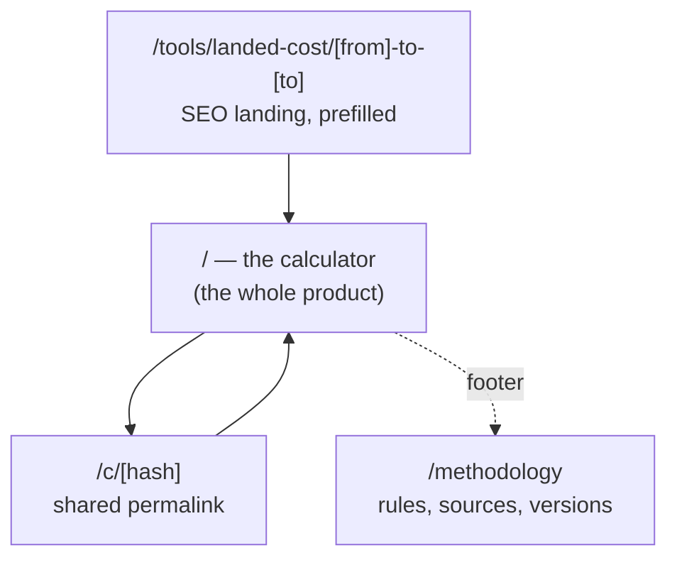
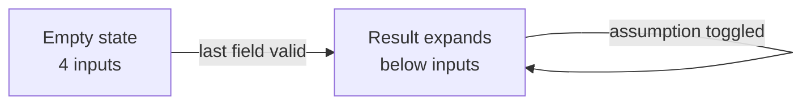

# WatchLedger — UI/UX Specification & Implementation Plan

> **Phase 1 surface: the landed-cost decision page.**
> Companion to [WATCHLEDGER_MASTER_README.md](WATCHLEDGER_MASTER_README.md).
> The blueprint says *what and why*. This document says *what the user sees, how it behaves, and in what order it gets built*.

---

## Table of contents

1. [The user we are designing for](#1-the-user-we-are-designing-for)
2. [Design principles](#2-design-principles)
3. [Information architecture](#3-information-architecture)
4. [The single page, in detail](#4-the-single-page-in-detail)
5. [States and edge cases](#5-states-and-edge-cases)
6. [Interaction and motion](#6-interaction-and-motion)
7. [Visual system](#7-visual-system)
8. [Accessibility](#8-accessibility)
9. [Copy rules](#9-copy-rules)
10. [Share artefacts](#10-share-artefacts)
11. [Retention surface](#11-retention-surface)
12. [Corridor SEO pages](#12-corridor-seo-pages)
13. [Technical implementation](#13-technical-implementation)
14. [Build steps](#14-build-steps)
15. [Definition of done](#15-definition-of-done)
16. [Deliberate non-goals](#16-deliberate-non-goals)

---

## 1. The user we are designing for

### The ICP

> A European or UK buyer about to spend €10,000+ importing a watch, who suspects the price is too good to be true and cannot find a straight answer anywhere.

### The moment

It is 11pm. They have a listing open in another tab. A watch that costs €24,900 locally is showing at €19,847 from a Japanese dealer. They have found three contradictory forum threads and one blog post from 2019. They are about to wire a large amount of money to a country they have never visited.

**They are anxious, not curious.**

### What they actually want

Not a landed cost. Not a duty rate. They want:

> **"Tell me whether to press the button."**

Every design decision below serves that sentence.

### Design consequence

| Their state | What the UI must do |
|---|---|
| Anxious | Answer immediately, in plain language |
| Sceptical (been burned before) | Show the working, on demand |
| Time-poor, on a phone | One screen, no steps, no signup |
| Not a tax expert | Never require them to know an HS code |
| About to make a big decision | Be calm, precise, and never oversell |

---

## 2. Design principles

### P1 — One number is the hero

The user came for a single answer. Everything else on the page is at most half its visual weight. If a second element competes with the total, the design has failed.

### P2 — Rigour is felt, not displayed

The architecture behind this product is paranoid: content-addressed verdicts, versioned rulesets, cited rules. **The interface must not show off about it.**

The user should feel *"this thing is careful."* They should never have to read about how careful it is.

- Provenance lives behind an **ⓘ**, not inline
- Ruleset version lives in the footer, not the header
- The methodology page does its work by *existing*, for the 2% who check

**The warm interface over the paranoid machine is the brand.**

### P3 — Progressive disclosure, three tiers

```
Tier 1   The verdict          — 80% of users stop here
Tier 2   The comparison       — the question underneath the question
Tier 3   The receipt          — for sceptics, collapsed by default
```

Serve the majority without failing the minority.

### P4 — Plain language over correct terminology

| Never write | Write instead |
|---|---|
| Estimated landed cost | You'll pay about |
| Customs value (CIF) | *(only inside the receipt)* |
| Ad valorem duty | Import duty |
| Insufficient data coverage | We don't cover Ireland yet |

Anxious people do not parse jargon.

### P5 — Assumptions are visible and editable, never silent

If a value moved the total, it is on screen and the user can change it. Nothing important hides behind "Advanced".

### P6 — Uncertainty is shown, not disclaimed

An estimate presented as a single hard number is a lie. An estimate presented as a range with a marker is honest **and** more trustworthy — it signals care rather than overconfidence.

### P7 — No account until there is a reason

No login for the calculation. Email is requested only for alerts, only after value has already been delivered.

---

## 3. Information architecture

Phase 1 is deliberately tiny. Four routes.



| Route | Purpose | Rendering |
|---|---|---|
| `/` | The calculator. Empty state → result on the same page | Server-rendered shell, htmx swaps |
| `/tools/landed-cost/[from]-to-[to]` | One page per corridor. Prefilled, indexable, canonical | Static, generated per corridor |
| `/c/[hash]` | Shared result. Full server render for link unfurls | Server-rendered |
| `/methodology` | Rules, sources, verification dates, ruleset version | Generated from the rules table |

**No dashboard. No account area. No settings.** Phase 1 has no logged-in state.

---

## 4. The single page, in detail

### 4.1 The core interaction model

Not a form page and a results page. **One page that transforms.**



- No submit button
- No page navigation
- The result **expands downward**; inputs stay visible and stay editable
- URL updates via `history.replaceState` so the state is always shareable

The user never loses their place and never wonders whether it worked.

---

### 4.2 Empty state

```
┌──────────────────────────────────────────────────────────┐
│  WatchLedger                              Methodology    │
├──────────────────────────────────────────────────────────┤
│                                                          │
│                                                          │
│        That watch from abroad.                           │
│        What will it actually cost you?                   │
│                                                          │
│        Import duty, VAT, and currency spread —           │
│        calculated from official rates we verify          │
│        and cite.                                         │
│                                                          │
│    ┌──────────────┐ ┌──────────┐ ┌──────────────────┐   │
│    │  3,200,000   │ │  JPY  ▾  │ │  from Japan   ▾  │   │
│    └──────────────┘ └──────────┘ └──────────────────┘   │
│                                                          │
│    delivered to  ┌──────────────────┐                    │
│                  │  Portugal     ▾  │                    │
│                  └──────────────────┘                    │
│                                                          │
│    Covered corridors:  JP→PT · US→UK · CH→DE · HK→EU     │
│                                                          │
└──────────────────────────────────────────────────────────┘
```

**Rules for this state:**

- The headline is the user's own question, reflected back
- Four fields, nothing else. No "Advanced options" link
- Currency auto-selects from the origin country, but stays editable
- Destination defaults from IP geolocation, clearly changeable
- Covered corridors are visible **before** the user invests effort — never let them fill a form only to be told no

---

### 4.3 Tier 1 — the verdict

Appears the moment the last field is valid.

```
┌──────────────────────────────────────────────────────────┐
│                                                          │
│           You'll pay about                               │
│                                                          │
│              € 26,125                                    │
│                                                          │
│           not the € 19,847 on the listing                │
│           ────────────────────────────────               │
│                                                          │
│           € 6,278 more   ·   +31.6%                      │
│                                                          │
│        € 25,400 ──────────●────────── € 26,900           │
│                     most likely                          │
│                                                          │
└──────────────────────────────────────────────────────────┘
```

**Why each element exists:**

| Element | Purpose |
|---|---|
| "You'll pay about" | Plain language. Signals estimate without a disclaimer |
| The large total | The single reason they came (P1) |
| "not the €19,847 on the listing" | **The emotional payload.** The gap is the insight |
| The delta and percentage | Makes the abstract concrete |
| The range band | Honest uncertainty, communicated visually (P6) |

**The strikethrough on the listing price is deliberate.** It is the visual moment where the illusion breaks. It should be a soft rule, not aggressive — this is information, not an accusation.

---

### 4.4 Tier 2 — the comparison

**This is the highest-value block on the page**, because it answers the question underneath the question.

```
┌──────────────────────────────────────────────────────────┐
│  Compared with buying in Portugal                        │
│                                                          │
│  Importing this one            € 26,125                  │
│  Typical local asking price    € 24,900                  │
│  ──────────────────────────────────────────              │
│  Importing costs you           € 1,225 more              │
│                                                          │
│  Based on 14 local listings · updated 6 Sept        ⓘ    │
└──────────────────────────────────────────────────────────┘
```

Nobody wants a landed cost in the abstract. They want to know **whether to press the button.** This block answers it directly.

**Phase 1 constraint:** local comparison data does not exist yet (it arrives in Phase 2–3). Until then this block renders honestly:

```
┌──────────────────────────────────────────────────────────┐
│  Compared with buying locally                            │
│                                                          │
│  We don't publish local price data for this model yet.   │
│  We only publish numbers we can evidence.                │
│                                                          │
│  ┌──────────────────────────┐  ┌────────────────────┐    │
│  │  your@email.com          │  │  Tell me when      │    │
│  └──────────────────────────┘  └────────────────────┘    │
└──────────────────────────────────────────────────────────┘
```

This turns a gap into a demand signal **and** demonstrates the honesty positioning at the exact moment it matters most.

---

### 4.5 Tier 3 — the receipt

Collapsed by default. One control:

```
  Show the breakdown  ▾
```

Expanded:

```
┌──────────────────────────────────────────────────────────┐
│                                                          │
│  Item price            ¥ 3,200,000    →     € 19,847     │
│    ECB reference rate 8 Sept 2026 · 0.006202        ⓘ    │
│    Card / bank spread  1.5%  ✎              € 298        │
│                                                          │
│  Shipping + insurance  ✎                    € 180        │
│                                                          │
│  ──────────────────────────────────────────────────────  │
│  Customs value (CIF)                        € 20,325     │
│                                                          │
│  Import duty   4.5%  ·  HS 9102.21     ⓘ    € 915        │
│  Import VAT    23%   ·  on CIF + duty  ⓘ    € 4,885      │
│  ──────────────────────────────────────────────────────  │
│  Total                                      € 26,125     │
│                                                          │
└──────────────────────────────────────────────────────────┘
```

**Two affordances, both essential:**

**ⓘ — provenance.** Opens a small popover:

```
┌────────────────────────────────────────────┐
│  Import VAT — Portugal                     │
│                                            │
│  Standard rate 23%, charged on customs     │
│  value plus duty.                          │
│                                            │
│  Source: Autoridade Tributária             │
│  portaldasfinancas.gov.pt/...      ↗       │
│                                            │
│  Verified 14 Aug 2026                      │
└────────────────────────────────────────────┘
```

This is where the compliance architecture becomes **visible trust** rather than invisible discipline. One click away — never zero (clutter), never three (hidden).

**✎ — editable.** Shipping and FX spread are estimates. Let the user correct them and watch the total move. Editable assumptions convert scepticism into engagement.

---

### 4.6 Assumptions strip

Directly beneath the total, always visible:

```
  Assumptions
  ┌──────────────────┐ ┌────────────────────┐ ┌───────────────┐
  │ Private seller ▾ │ │ Courier (DHL)    ▾ │ │ Full VAT    ▾ │
  └──────────────────┘ └────────────────────┘ └───────────────┘
```

| Assumption | Options | Effect |
|---|---|---|
| Seller type | Private · Dealer · Auction | May change VAT treatment |
| Shipping method | Courier · Postal · Hand-carry | Changes clearance and fees |
| VAT treatment | Full VAT · Margin scheme | Large effect where applicable |

When one changes, **the total animates to its new value** rather than snapping. That half-second of movement is what makes the number feel *calculated* rather than *asserted*.

---

### 4.7 Footer

Quiet, small, permanent:

```
──────────────────────────────────────────────────────────────
Estimate only — not customs advice. Actual charges depend on
your customs authority's valuation.

Rules v2026.09.1 · FX 8 Sept 2026 · Methodology · Sources
```

The ruleset version belongs here, not in the header. It exists for the auditor, not the buyer.

---

## 5. States and edge cases

Every state below is a **designed screen**, not an error.

### 5.1 Unsupported corridor

The most common early failure. Handle it as a capability statement plus a promise.

```
┌──────────────────────────────────────────────────────────┐
│                                                          │
│   We don't cover Japan → Ireland yet.                    │
│                                                          │
│   We only publish rates verified against official        │
│   sources. Ireland isn't done.                           │
│                                                          │
│   ┌──────────────────────────┐  ┌──────────────────┐     │
│   │  your@email.com          │  │  Tell me when    │     │
│   └──────────────────────────┘  └──────────────────┘     │
│                                                          │
│   Corridors we cover today:                              │
│   Japan → Portugal · USA → UK · Switzerland → Germany    │
│                                                          │
└──────────────────────────────────────────────────────────┘
```

Three things happen: you **explain why** (builds trust), you **capture demand** with an email, and you **route them** to something that works. A dead end becomes roadmap input.

### 5.2 Stale rule

If any rule in the calculation has `verified_at` older than 180 days:

```
  ⚠  Our Portugal VAT rule was last verified 14 March 2026.
     Rates may have changed. We are re-checking.
```

Inline, above the total. Amber, not red. **The number still renders** — degrade toward saying less, never toward saying nothing when a caveat suffices.

### 5.3 FX unavailable

Fall back to the last cached ECB rate and label it:

```
  FX rate from 5 Sept 2026 (latest available)
```

Never silently use a stale rate. Never block the calculation.

### 5.4 Invalid input

Inline, beside the field, never a modal, never a red page:

```
  ┌──────────────┐
  │  32000000000 │  That looks unusually high — is it correct?
  └──────────────┘
```

Phrase as a question, not a rejection. The user might be right.

### 5.5 Below de minimis

Where duty or VAT does not apply:

```
  No import duty — value is below Portugal's €150 threshold.  ⓘ
```

Show the *absence* of a charge explicitly. A line that says "€0 because X" is more trustworthy than a missing line.

---

## 6. Interaction and motion

### Timing

| Interaction | Behaviour |
|---|---|
| Typing in amount | Debounce 300ms, then recalculate |
| Changing currency/country | Recalculate immediately |
| Toggling an assumption | Recalculate immediately |
| Result first appears | Expand + fade, 250ms, ease-out |
| Total changes | Count animation 400ms, ease-out |
| Receipt expand/collapse | Height transition 200ms |
| Popover | Fade 120ms |

### The count animation is not decoration

When the total moves from €26,125 to €24,945, the digits should **roll**, not swap. This communicates that a computation occurred. A snapped number reads as a lookup; an animated number reads as a calculation.

Respect `prefers-reduced-motion`: disable rolling and fades, keep the state change instant.

### No blocking spinners

Calculation is server-side but sub-100ms. If it ever exceeds that, dim the previous total to 60% opacity rather than replacing it with a spinner. **Never show an empty state where a number was.**

---

## 7. Visual system

### Tone

Calm, editorial, precise. Closer to a well-set financial document than a SaaS dashboard. The user is making a serious decision; the page should feel serious without being cold.

### Type

| Role | Treatment |
|---|---|
| The total | Serif display, very large, tabular figures |
| Headline | Serif, medium |
| All data, labels, UI | Sans, tabular figures **always** for money |
| Receipt lines | Sans, tabular, right-aligned amounts |

**Tabular figures are non-negotiable.** Money that shifts horizontally as digits change looks broken and undermines the precision claim.

### Colour

| Use | Guidance |
|---|---|
| Background | Warm off-white, not pure white |
| Text | Deep charcoal, not black |
| The total | Text colour — **not** an accent colour |
| Accent | One muted colour, used for links and focus only |
| Warning | Amber, reserved exclusively for staleness |
| Never | Red for the total, green for savings, gradients, colour-coded verdicts |

**The total must not be red.** Red says error. The number is not an error — it is the truth. Charcoal says fact.

### Spacing

Generous. The verdict block should have significant breathing room above and below. Density is appropriate in the receipt, never in the verdict.

### Layout

- Single column throughout, max-width ~680px for the result
- Mobile-first: this is an 11pm phone decision
- On desktop the layout does not become two columns — it simply centres. Width is not an invitation to add things

---

## 8. Accessibility

| Requirement | Implementation |
|---|---|
| Keyboard complete | Every control reachable and operable; visible focus rings |
| Screen readers | Result region is `aria-live="polite"` so the total is announced on change |
| Popovers | Focus moves in, `Esc` closes, focus returns to trigger |
| Contrast | WCAG AA minimum throughout; AAA for the total |
| Reduced motion | `prefers-reduced-motion` disables count roll and transitions |
| Zoom | Usable at 200% without horizontal scroll |
| Not colour-alone | Staleness warning carries an icon and text, not just amber |
| No-JS | Form posts and renders the result server-side. **The product works without JavaScript** |

The no-JS requirement is not pedantry — it forces a server-rendered result, which is what makes link unfurls and SEO work correctly.

---

## 9. Copy rules

### Voice

Plain, calm, specific. Never salesy. Never apologetic.

### Banned phrases

| Never | Reason |
|---|---|
| "true value" | False precision |
| "guaranteed" / "accurate to the cent" | Cannot be true |
| "best price" / "great deal" | We are not a marketplace |
| "AI-powered" | Determinism is the product |
| "Oops!" / "Something went wrong" | Infantilising; say what happened |

### Required phrasings

| Situation | Copy |
|---|---|
| The total | "You'll pay about" |
| Missing coverage | "We don't cover X yet" — never "no data" |
| Missing local prices | "We only publish numbers we can evidence" |
| Legal footer | "Estimate only — not customs advice" |
| Stale rule | "Last verified [date]. We are re-checking." |

### The rule underneath all of them

> Every sentence either **gives the answer** or **explains the limits of the answer.** Nothing else earns its place on the page.

---

## 10. Share artefacts

The blueprint calls the negotiation brief "the share vector" and schedules it for Phase 4. **A shareable landed-cost result is the same mechanism and costs almost nothing in Phase 1.**

### Permalink

Every calculation encodes its inputs in the URL:

```
/c/a3f9d2e1
```

The hash resolves to stored inputs plus `rules_version` and `fx_date`, so the page **re-derives byte-identically** whenever it is opened. A link shared today shows the same numbers next year — with the original FX date visible.

### Actions under the result

```
  ┌──────────────────┐  ┌────────────────────┐
  │   Copy link      │  │   Save as PDF      │
  └──────────────────┘  └────────────────────┘
```

PDF via **print CSS only** — no library, no service. A dedicated `@media print` stylesheet that expands the receipt, hides interactive controls, and adds the methodology footer.

### Unfurl card

The shared page must render **fully server-side** so Discord, Reddit, WhatsApp and Slack preview it correctly:

```
og:title        Japanese import: €19,847 listed → €26,125 landed
og:description  Import duty, VAT and FX for Japan → Portugal.
                Rules v2026.09.1, sources cited.
og:image        Generated card showing both numbers
```

The unfurl card is the advert. Someone posting *"am I mad to buy this from Japan?"* now posts your link instead of a screenshot — **and the preview does the persuading before anyone clicks.**

---

## 11. Retention surface

Cross-border buyers are the ideal ICP with one flaw: they buy rarely. The blueprint's answer is alerts in Phase 5. That is too late. Here is the Phase 1 version that needs no auth.

### The hook

Appears below the result, after value has been delivered:

```
┌──────────────────────────────────────────────────────────┐
│  ⌁  Watch this corridor                                  │
│                                                          │
│  The yen moves. We'll email you if this drops below      │
│  ┌───────────┐                                           │
│  │ € 25,000  │                                           │
│  └───────────┘                                           │
│                                                          │
│  ┌──────────────────────────┐  ┌──────────────────┐      │
│  │  your@email.com          │  │  Watch this      │      │
│  └──────────────────────────┘  └──────────────────┘      │
│                                                          │
│  One email when it triggers. Unsubscribe in one click.   │
└──────────────────────────────────────────────────────────┘
```

The threshold is **prefilled just below the current total** — the user only has to accept it.

### The email

```
Subject:  That Japanese Speedmaster is now €1,180 cheaper

The yen moved. Your watch now lands at €24,945 —
below the €25,000 you were watching for.

  Listed        ¥3,200,000
  Landed now    €24,945     (was €26,125 on 8 Sept)

  [ See the full breakdown ]

You asked us to watch Japan → Portugal.
Unsubscribe · one click
```

Genuinely useful, arrives at exactly the right moment, and converts a one-shot tool into a relationship. **It needs only FX data you already fetch daily.**

### Double opt-in

Confirm the email before sending anything. It costs one screen and protects the domain reputation the whole company depends on.

---

## 12. Corridor SEO pages

One static page per corridor. These are the organic front door.

```
/tools/landed-cost/japan-to-portugal
/tools/landed-cost/usa-to-uk
/tools/landed-cost/switzerland-to-germany
```

### Structure

```
H1    Importing a watch from Japan to Portugal
      What you'll actually pay

      [ Calculator, prefilled with this corridor ]

H2    What you pay on top of the price
      — 4.5% import duty · 23% VAT on CIF + duty · FX spread
      — Each with its official source link and verified date

H2    Worked example
      — A real €20,000 watch, fully broken down

H2    When duty doesn't apply
      — De minimis thresholds, gifts, personal effects

H2    Common mistakes
      — VAT is charged on CIF *plus* duty, not the item price
      — Courier handling fees are separate
      — "DDP" listings may not include everything

      Sources · Last verified 14 Aug 2026
```

### Rules

- The calculator is **above the fold**, prefilled. The content is below it, for the crawler and the careful reader
- One canonical URL per corridor; no query-string duplicates indexed
- `FAQPage` structured data on the mistakes section
- Fully static, no JS required to see the content
- Every rate on the page links to its official source

**Target queries** are long-tail and near-uncontested: *"import duty watch japan portugal"*, *"buying watch from japan customs vat"*, *"is it cheaper to buy a watch from japan"*.

---

## 13. Technical implementation

Consistent with the existing decisions: Go, SQLite, server-rendered templates, htmx.

### Routes

| Route | Method | Returns |
|---|---|---|
| `/` | GET | Calculator shell, empty state |
| `/calc` | POST | Result fragment (htmx target) |
| `/c/{hash}` | GET | Full page, server-rendered result |
| `/tools/landed-cost/{from}-to-{to}` | GET | Static corridor page + prefilled calculator |
| `/methodology` | GET | Rules rendered from the rules table |
| `/watch` | POST | Corridor alert signup (double opt-in) |
| `/confirm/{token}` | GET | Email confirmation |
| `/unsubscribe/{token}` | GET | One-click unsubscribe |
| `/og/{hash}.png` | GET | Generated unfurl card |

### The htmx pattern

```html
<form hx-post="/calc"
      hx-trigger="input changed delay:300ms from:find input,
                  change from:find select"
      hx-target="#result"
      hx-swap="innerHTML"
      hx-push-url="false">
```

The server returns the entire result region as HTML. **No client-side calculation.** No duplicated money logic in JavaScript — the engine exists once, in Go, with `Decimal`.

The URL is updated with `history.replaceState` after the swap so the state is shareable without polluting browser history on every keystroke.

### Progressive enhancement

Without JavaScript, the same form posts normally and the server renders the full page including the result. htmx only removes the page reload. **The product is fully functional with JS disabled.**

### Money handling

| Rule | Implementation |
|---|---|
| Decimal only | `shopspring/decimal` end to end |
| Never float | Not in the engine, not in JSON, not in templates |
| JSON money is a string | `"26125.00"`, never `26125.0` |
| Quantize once | At render time only, never mid-calculation |
| Tabular figures | `font-variant-numeric: tabular-nums` on every money element |

### Determinism

The result fragment embeds:

```html
<div id="result"
     data-rules-version="2026.09.1"
     data-fx-date="2026-09-08"
     data-inputs-hash="a3f9d2e1">
```

`/c/{hash}` re-derives from stored inputs + the pinned ruleset, so a shared link is reproducible forever. This is the same invariant as the verdict engine, applied to the calculator.

### Data the page needs

```
tax_rules      from_country, to_country, hs_code, duty_rate, vat_rate,
               duty_basis, vat_basis, de_minimis, source_url, verified_at

fx_rates       date, base, quote, rate, source        (ECB daily, cached)

calculations   hash, inputs_json, rules_version, fx_date, created_at

watches        email_hash, corridor, threshold, confirmed, token
```

---

## 14. Build steps

Ordered so that something usable exists as early as possible.

### Step 1 — Rules data

- [ ] `tax_rules` table with `source_url` and `verified_at` **required** (NOT NULL)
- [ ] Seed three corridors only: **JP→PT, US→UK, CH→DE**
- [ ] Each rate manually verified against the official tariff/tax authority page, link recorded
- [ ] Constraint: a rule without `source_url` + `verified_at` cannot exist

**Done when:** three corridors have complete, cited rules in the database.

### Step 2 — FX

- [ ] Daily fetch of ECB reference rates, cached in `fx_rates` with the rate date
- [ ] Card/bank spread as a user-editable input, default 1.5%
- [ ] Fallback to most recent cached rate, always labelled with its date

**Done when:** conversion works offline from cache and always states which date it used.

### Step 3 — The engine

- [ ] `internal/landedcost` — pure, no I/O, `Decimal` only
- [ ] Returns a line-item breakdown; every line carries `basis` and `rule_ref`
- [ ] Handles de minimis, margin scheme, seller type, shipping method
- [ ] Embeds `rules_version` + `fx_date` in every result
- [ ] Golden tests per corridor with frozen FX rates

**Done when:** the golden suite passes and no float appears anywhere in the money path.

### Step 4 — The page, server-rendered

- [ ] Empty state with four inputs
- [ ] `POST /calc` returns the result fragment
- [ ] Tier 1 verdict, Tier 3 receipt (collapsed), assumptions strip
- [ ] Works entirely without JavaScript

**Done when:** a real Japan → Portugal query returns a correct, cited breakdown with JS disabled.

### Step 5 — Interaction layer

- [ ] htmx wiring, 300ms debounce
- [ ] Count animation on the total
- [ ] Receipt expand/collapse
- [ ] ⓘ popovers with source, link, verified date
- [ ] ✎ editable shipping and FX spread
- [ ] `prefers-reduced-motion` honoured

**Done when:** the page recalculates live and never shows a spinner or an empty total.

### Step 6 — States

- [ ] Unsupported corridor screen with demand capture
- [ ] Stale rule warning (>180 days)
- [ ] FX fallback label
- [ ] De minimis "no duty because" line
- [ ] Inline input validation phrased as questions

**Done when:** every failure mode is a designed screen, not an error.

### Step 7 — Share

- [ ] Persist calculations, hash the inputs
- [ ] `/c/{hash}` full server render
- [ ] Copy-link button
- [ ] Print CSS producing a clean one-page PDF
- [ ] OG tags + generated unfurl image

**Done when:** a shared link previews correctly in Discord and Reddit and re-derives identically.

### Step 8 — Corridor pages

- [ ] Static page per corridor, calculator prefilled above the fold
- [ ] Content sections: what you pay, worked example, when duty doesn't apply, common mistakes
- [ ] `FAQPage` structured data, canonical URL, sitemap

**Done when:** three corridor pages are live, indexed, and score ≥95 on Lighthouse.

### Step 9 — Retention

- [ ] Corridor watch form with prefilled threshold
- [ ] Double opt-in, one-click unsubscribe
- [ ] Daily job: recompute watched corridors against new FX, send on crossing
- [ ] Demand-capture list for uncovered corridors

**Done when:** an FX move triggers a correct alert email end to end.

### Step 10 — Methodology

- [ ] `/methodology` generated **from the rules table**, never hand-written
- [ ] Lists every rule, rate, source link, verified date, ruleset version
- [ ] Linked once from the footer

**Done when:** the published methodology and the shipped rules cannot disagree, because they share a source.

---

## 15. Definition of done

Phase 1 is complete when **all** of the following are true:

| # | Criterion |
|---|---|
| 1 | A real user can answer "what will this Japanese watch cost me in Portugal?" in under 30 seconds, with no account |
| 2 | Every number on screen traces to a rule row with a working source link and a verified date |
| 3 | The product works fully with JavaScript disabled |
| 4 | A shared link re-derives byte-identically and previews correctly in Discord and Reddit |
| 5 | Three corridor pages are indexed and score ≥95 on Lighthouse |
| 6 | An FX move triggers a correct alert email |
| 7 | Every failure state is a designed screen with a next action |
| 8 | No float has touched a money value anywhere in the stack |
| 9 | The methodology page is generated from the same rules the engine uses |
| 10 | Uncovered corridors capture demand instead of dead-ending |

---

## 16. Deliberate non-goals

Explicitly **not** in Phase 1. Recorded so they do not creep in.

| Excluded | Why |
|---|---|
| User accounts | Nothing yet justifies the friction |
| A dashboard | The user has one question, once |
| Client-side calculation | Duplicates money logic — the one thing that must exist once |
| Multi-currency output | One destination currency is the answer they need |
| Watch model selection | Not needed for landed cost. It arrives with Phase 2 data |
| Comparison of shipping providers | Scope creep into a different product |
| Dark mode | Not until the light theme is finished and validated |
| Any JS framework | htmx covers every interaction listed here |
| Charts | A range band communicates uncertainty; a chart would decorate it |
| Onboarding, tooltips tour, modals | If the page needs explaining, the page is wrong |

---

## The specification in one line

> **One page, four inputs, one enormous honest number — with the receipt, the sources, and the assumptions all one click away and never in the way.**

The interface is warm and simple. The machine behind it is paranoid. That contrast is the brand.
